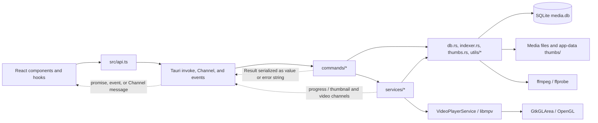

# System overview

Implementation entry points: [Tauri bootstrap](../../src-tauri/src/lib.rs), [workflow locks](../../src-tauri/src/app/locks.rs), [application state](../../src-tauri/src/app/state.rs).

This page describes the architecture that is implemented today. The source code and executable configuration are authoritative.

For narrower contracts, use the canonical pages for [frontend architecture](../frontend/architecture-and-ui-conventions.md), [IPC](ipc-contract.md), [database persistence](../subsystems/database.md), [scanning](../subsystems/scanning-and-indexing.md), [library queries and the gallery](../subsystems/library-query-and-gallery.md), [thumbnails](../subsystems/thumbnails.md), [search, tags, and media groups](../subsystems/search-tags-and-media-groups.md), [lightbox behavior](../subsystems/lightbox.md), [settings operations](../subsystems/settings-operations.md), and [data safety and portability](../subsystems/data-safety-and-portability.md).

## Architecture and data flow

The normal request path is:

1. `src/main.tsx` loads i18n and styles, applies the persisted theme before rendering, and mounts `App` under React `StrictMode`. Optional frontend performance instrumentation is enabled by `VITE_MEDIATAGGER_PERF=1`.
2. `App.tsx` mounts `UiLayerProvider` and delegates application state and actions to `useAppShellController`. Settings and lightbox are lazy-loaded and prefetched after 1.5 seconds; the gallery and bulk sidebar are eagerly imported. See [frontend composition](../frontend/architecture-and-ui-conventions.md#lazy-loading-and-delayed-prefetch) for loading and failure UI.
3. Feature hooks call typed wrappers in `src/api.ts`. Those wrappers translate UI concepts into Tauri command names and payloads, create IPC channels for thumbnail and video events, and use `convertFileSrc` for image/GIF URLs.
4. Tauri dispatches the request to a function registered by `tauri::generate_handler!` in `src-tauri/src/lib.rs`. Command functions validate or normalize inputs, obtain `AppState`, acquire a workflow lock where required, and either perform a small operation or delegate to a service.
5. Services coordinate scanning, query sessions, backups, progress, and thumbnail scheduling. `db.rs` owns SQL; `indexer.rs` discovers and inspects media; `thumbs.rs` performs image/video probing and rendering; filesystem mutations occur in the command or service responsible for that workflow.
6. Results return through the invoke promise. Long-running settings work also emits `process-progress`; on-demand thumbnail batches and native video sessions use channels.

Concrete examples:

- Gallery refresh calls `startAssetQuery`, which invokes `start_asset_query`. The query manager reads the library revision through a small connection pool, caches at most four ID-list sessions for five minutes, and materializes requested summaries from SQLite. Later pages call `get_asset_query_page`; a revision mismatch returns `stale`, causing the frontend to refresh.
- A scan invokes `scan_folder` or `rescan_all_roots`, takes the scan lock, walks supported files, fingerprints them, extracts metadata (including video duration through ffprobe/ffmpeg), commits batched SQLite updates, and removes stale database rows. Scanning reads source media; it does not copy it into app data.
- Visible gallery items are queued by asset ID. `ensure_thumbnails` takes a shared thumbnail lock and submits deduplicated high-priority jobs to the process-wide scheduler. Images are decoded in Rust; video frames use ffmpeg. Successful paths and failures are persisted in SQLite, and the generated files live under the profile's `thumbs/` directory.
- Delete, rename, root removal, library clear, and bundle restore cross both SQLite and the filesystem. These operations take both workflow locks, always in the order described below.
- Image, GIF, and thumbnail paths use Tauri's asset protocol. Video opens by asset ID after backend path authorization. libmpv renders into a GTK `GLArea` above the WebView, with native controls above the video. DOM controls must stay outside those native bounds. See [lightbox media presentation](../subsystems/lightbox.md#media-presentation) for authorization, layout, and session behavior.

## Executable bootstrap and runtime lifecycle

`src-tauri/src/main.rs` is deliberately only the binary entry point and calls `media_tagger::run()`. The actual Tauri bootstrap is the library function `run()` in `src-tauri/src/lib.rs`, which:

1. creates a `tauri::Builder` and installs the dialog plugin;
2. during `setup`, refuses a debug build unless its effective identifier is the established development or E2E identifier;
3. resolves and creates the identifier-specific app-data directory;
4. acquires and manages the profile's `InstanceLock` before opening the database;
5. recovers any interrupted journaled database/thumbnail restore before creating `thumbs/` or opening `media.db`, then initializes or migrates the schema and reconciles pending source-file operations;
6. resolves ffmpeg, restores `LC_NUMERIC` to `C` after GTK initialization for libmpv, creates the process-wide `VideoPlayerService`, and installs the GTK video surface;
7. creates the thumbnail scheduler and refuses startup if any worker failed to spawn, then manages `AppState`;
8. registers every frontend-callable command; and
9. runs the generated Tauri context until the application exits.

Startup failure in any setup step prevents the windowed application from entering its normal event loop. `build.rs` only calls `tauri_build::build()`; compile-time application metadata and resources come from the effective Tauri configuration.

## Backend module boundaries

| Module | Current responsibility |
| --- | --- |
| `main.rs` | Native binary shim only. |
| `lib.rs` | Builder setup, profile safety guard, app-data initialization, managed state, command registration, ffmpeg resolution, and process launch. |
| `app/state.rs` | Process-wide shared runtime state. |
| `app/instance_lock.rs` | Per-profile interprocess ownership of the app-data directory. |
| `app/locks.rs` | In-process workflow lock helpers and the canonical combined lock order. |
| `commands/*` | Tauri IPC endpoints, validation, error-string conversion, and some orchestration. Commands are intended to be thin, although several asset and import/export commands still contain substantial workflow logic. |
| `services/*` | Asset-query sessions, safe/journaled asset file mutation, SQLite connection pooling, native video playback, scan orchestration, thumbnail workflows, backup/restore, and progress emission. |
| `video_surface.rs` | GTK overlay/GLArea placement and libmpv OpenGL rendering. |
| `db.rs` and `db/*` | Shared types plus separate connection, schema, query, mutation, scan-membership, and thumbnail SQL modules. Connections use WAL, `synchronous=NORMAL`, foreign keys, a memory temp store, cache/mmap tuning, and a five-second busy timeout. |
| `indexer.rs` | Supported-file discovery, fingerprints, and media metadata extraction. |
| `thumbs.rs` | Image/video thumbnail creation and video duration probing. |
| `models.rs` | Backend serializable data models. |
| `utils/*` | Path and tag normalization helpers. |
| `error.rs` | `AppError` and `AppResult`; command boundaries currently flatten errors to strings. |

### Managed state

`AppState` contains:

- the profile-specific `db_path` and `thumbs_dir`;
- the resolved `ffmpeg_path` (also copied into the scheduler);
- `scan_lock` and `thumb_lock`;
- the shared `ThumbnailScheduler`; and
- atomics that enforce one bulk-thumbnail render, carry its cancellation request, guard thumbnail publication with a generation epoch, and preserve cancellation without database or workflow locks.

`StartupScanState` is separately managed by Tauri. It captures enabled scan roots after database initialization and recovery and atomically consumes them when shell initialization invokes the startup-scan command. Its empty state survives frontend reloads; preference changes apply to the next process. Startup scanning uses the normal blocking pool, scan lock, and progress pipeline.

The `InstanceLock` and `VideoPlayerService` are separately managed by Tauri so their lifetimes match the application. The player service owns one process-wide libmpv handle, one active session, a dedicated playback worker, and monotonically increasing request/session IDs. The worker owns libmpv commands and per-session event clients; GTK only enqueues playback commands. `services/video_events.rs` checks native client creation and copies event information before the next poll invalidates it. Pending reservations can be cancelled before source resolution completes. It rejects stale controls and superseded opens, while retired-session closes are idempotent. `AppState.database` owns admission, the connection pool, and query state. One operation permit follows its connections and child workers. Idle connections retain no admission.

## Profiles, identifiers, and data isolation

The effective Tauri identifier determines `app.path().app_data_dir()`, so it is the boundary for `media.db`, `thumbs/`, restore staging, and `instance.lock`.

| Profile | How it is selected | Product/window name | Identifier | Isolation behavior |
| --- | --- | --- | --- | --- |
| Release | `bun run tauri:build:release` / base `tauri.conf.json` | `Tagrove` | `com.example.mediatagger` | Production app-data profile and normal `src-tauri/target` build output. |
| Development | `bun run tauri:dev`, merging `tauri.conf.dev.json` over the base | `Tagrove Dev` | `com.example.mediatagger.dev` | Separate app-data profile. Debug startup permits only the established dev/E2E identifiers, making use of the dev or E2E overlay mandatory for a debug application. |
| Desktop E2E | `bun run test:e2e:tauri`, merging `tauri.conf.e2e.json` | `Tagrove E2E` | `com.example.mediatagger.e2e` | Separate app data and `src-tauri/target-e2e`. The runner validates the identifier, title, and target path, clears only the exact E2E app-data directory, builds the frontend separately, then makes an unbundled debug Tauri build. |

Flatpak uses the local release identifier but receives Flatpak-specific XDG directories under `~/.var/app/<app-id>/`, so its first launch starts a fresh library. The native library is untouched. A configurable publication ID creates a separate Flatpak installation/profile. AppImage retains the native release profile.

All three window configurations set `decorations: false`. Profile overlays repeat this
setting because their `windows` arrays replace the base array. Native window titles use the
profile names above for task switchers and the E2E identity guard. The frontend headers own
window controls and drag regions; see [frontend window controls](../frontend/architecture-and-ui-conventions.md#compact-studio-visual-system).

These profiles may run at the same time because their identifiers resolve to different data directories and lock files. Isolation relies on always selecting the intended config overlay. The debug guard allows only `com.example.mediatagger.dev` and `com.example.mediatagger.e2e`, protecting both the local release ID and configurable publisher IDs. The E2E runner adds stronger path/title checks before its destructive cleanup and again verifies the live window title before tests.

### `instance.lock`

On startup, `InstanceLock::acquire` opens or creates `<app-data>/instance.lock` and requests a non-blocking exclusive OS file lock. Contention fails startup with a message that another Tagrove instance is using the profile. The open handle is retained by Tauri and explicitly unlocked on drop.

This guarantee is per identifier/profile, not machine-wide. The lock file itself may remain after a clean exit; ownership is represented by the OS lock, not file existence. The lock is acquired before `media.db` is opened, preventing two application processes from normally sharing one profile, but it does not protect against external tools editing that directory.

## In-process locking policy

The profile lock sits outside the runtime lock hierarchy. Inside one process, the maintenance gate is the outermost lock. Ordinary commands acquire one shared operation permit; bundle export/restore close admission, drain operations and workers, close the idle pool, clear query state, then acquire lower locks in the fixed order `maintenance`, `scan_lock`, exclusive `thumb_lock`.

Command-level workflow locks have the following matrix:

| Lock | Operations | What it excludes |
| --- | --- | --- |
| Database maintenance gate | Every SQLite connection; exclusive ownership for DB bundle export/restore | Exclusive ownership blocks new operations and drains admitted operations, including connections and workers. |
| `scan_lock: Mutex<()>` | `scan_folder`, `rescan_all_roots` | Another scan and every combined destructive operation. |
| Shared `thumb_lock` read guard | Render all/failed thumbnails, cancel bulk render, ensure one/page/streamed thumbnails | A destructive thumbnail write guard; multiple thumbnail readers may coexist. The bulk-render atomic separately rejects a second bulk render. |
| Exclusive `thumb_lock` write guard | `clear_all_thumbnails` | All thumbnail render/ensure readers and combined destructive operations. |
| `scan_lock` then exclusive `thumb_lock` | Remove scan root, delete or rename an asset file, clear library data | Scans, thumbnail work, and every other combined operation. |
| Maintenance gate, then `scan_lock`, then exclusive `thumb_lock` | Export a DB bundle, import a DB bundle | All SQLite users, scans, thumbnail work, and every other combined operation. |
| No workflow lock | Queries/details/tag and favorite/group writes, duplicate lookup, CSV import/export, scan-root list/add, and window-theme sync | Only SQLite/filesystem primitives and any operation-local synchronization apply. |

Whenever both ordinary workflow locks are needed, `with_scan_and_thumb_lock` acquires one operation permit, `scan_lock`, and then the thumbnail write lock. Maintenance uses `with_database_maintenance`, which closes admission, drains admitted operations, closes idle connections, and clears query sessions before taking `scan_lock` and the thumbnail write lock. Preserve these orders; acquiring lower locks before entering maintenance can deadlock. `ThumbnailScheduler`, the query cache, and the database connection pool have their own internal synchronization and are not substitutes for these workflow locks.

The React settings runner also suppresses concurrent settings operations in one mounted frontend, but that is a user-interface convenience, not a backend safety boundary. Direct IPC callers can still invoke commands concurrently.

## Native media dependencies

libmpv performs interactive playback; ffmpeg and ffprobe perform indexing and thumbnail work. See [setup prerequisites](../development/setup-and-build.md#prerequisites) for system packages and [tool discovery](../subsystems/thumbnails.md#ffmpeg-and-ffprobe-discovery) for executable precedence. Missing ffmpeg tools degrade metadata and thumbnails; native linkage and GTK/OpenGL failures can prevent playback or startup.

## Tauri security surface and Linux packaging

Current configuration is permissive and should be treated as current state, not a recommended end state:

- `capabilities/default.json` applies to the `main` window and grants `core:default`, `dialog:default` (open, save, and message dialogs), and the window permissions for minimize, toggle-maximize, close, drag and resize-drag. Application commands are those explicitly registered in `lib.rs`.
- The Tauri `protocol-asset` feature is compiled in. The asset protocol is enabled with scope `['**']`, allowing the WebView's asset URLs to address arbitrary filesystem paths accepted by that protocol. Images, GIFs, and thumbnails use this path. Video sources are authorized by asset ID and opened only by libmpv.
- `app.security.csp` is `null`, so the configuration does not install a Content Security Policy.
- Docker produces x86_64 Flatpak and AppImage packages. Flatpak uses GNOME 50 and installs under `/app`; AppImage builds on Debian 12. The Arch-native executable is an explicit option. Other platforms and ARM are not configured. See [packaging](../development/linux-packaging.md).

Security-sensitive changes should review capabilities, CSP, asset scope, dialog permissions, WebView arguments, and the direct `convertFileSrc` flow together. See [setup and build](../development/setup-and-build.md) for build prerequisites and commands.

## Naming state

The user-facing product name is **Tagrove**, with `Dev` and `E2E` suffixes for isolated profiles. The frontend header, HTML metadata, npm package, native window titles, and Linux launcher use Tagrove. The Woven T mark comes from `public/tagrove.svg`; `bun run icons:generate` creates the checked-in native PNG sizes. The Linux launcher uses `Name=Tagrove`, `Icon=tagrove`, and `Exec=media_tagger`.

The Rust crate/binary (`media_tagger`), Tauri identifiers, SQLite identity and backup format markers, local-storage keys, and performance variables retain their existing internal names. Older repository guidance and E2E suite labels still refer to MediaTagger.

This split is deliberate. Changing the Tauri identifier changes the app-data directory and can make an existing library appear empty unless data is migrated. Renaming the Rust binary also affects the E2E executable path. A future internal rename is a migration, not a cosmetic search-and-replace.

## Known limitations

- CSP is disabled and the asset scope is global.
- The debug profile allowlist has a focused unit test. The profile lock and ffmpeg search precedence are not directly unit-tested.
- Workflow locking remains selective outside database maintenance. Tag/favorite/group writes, CSV import, adding roots, and reads may overlap a scan, but they cannot overlap bundle snapshot/replacement because every live connection participates in the maintenance gate.
- `AppState` fields are public, so module boundaries are conventions rather than compiler-enforced interfaces.
- Several command handlers contain filesystem/DB orchestration instead of being strictly thin adapters.
- Backend errors are flattened to strings at IPC boundaries, so the frontend cannot reliably branch on structured error categories.
- Query supersession is shared by the application runtime. Another window or independent caller can supersede this window's query; frontend generations separately reject late responses. Thumbnail request generations belong to individual hooks and are not compared globally. See [IPC limits](ipc-contract.md#known-limitations).
- Many progress emissions deliberately ignore delivery errors; completion of the underlying operation does not guarantee that every progress update reached the WebView.
- Packaging supports Linux x86-64 only. Local Flatpak builds use the example-domain identifier; publication validation requires a supplied publisher identity.

## Safe-change checklist

Before merging an architectural change:

- Trace the complete path from the calling hook/component through `src/api.ts`, the registered Tauri command, service/core code, and every SQLite/filesystem effect. Update the [IPC contract](ipc-contract.md) if names, payloads, channels, events, or error semantics change.
- If adding a command, register it in `lib.rs`, expose it through `src/api.ts`, validate at the command boundary, and prefer orchestration in the appropriate service.
- Classify the operation in the lock matrix. Use the shared helpers; if both locks are needed, acquire scan before the exclusive thumbnail lock. Consider direct IPC concurrency, not only UI button state.
- For `AppState` changes, update bootstrap construction and all test fixtures. Decide whether the value truly belongs in managed state or in a focused service.
- For database writes, use transactions where a workflow must be atomic, bump the library revision when query-visible state changes, and invalidate process caches/pools when replacing the database. Follow [database](../subsystems/database.md) and [data safety](../subsystems/data-safety-and-portability.md) guidance.
- For file mutations, define failure ordering and rollback/repair behavior across the database, source file, thumbnail, WAL/SHM sidecars, and restore staging.
- Never reuse the production identifier or app-data cleanup target for dev/E2E. Preserve the E2E identifier/title/target assertions when changing configuration.
- When changing product, crate, or binary names, update packaging, icons, E2E paths, user-visible text, and data migration intentionally.
- When changing media loading, assess CSP, capabilities, asset-protocol scope, and whether paths can be constrained to registered roots and profile thumbnails.
- When changing native media dependencies, verify libmpv/GTK/OpenGL linkage and both ffmpeg tools in the Linux artifact.

## Verification map

Use [testing](../development/testing.md) for the full test workflow. The most relevant existing checks are:

- `src/__tests__/api.test.ts`: invoke payload mapping and media-path conversion.
- Frontend hook/component tests under `src/hooks/**/__tests__` and `src/components/**/__tests__`: query lifecycle, thumbnail queues, settings progress, mutation refreshes, and UI behavior.
- Rust unit tests in `db.rs`, `commands/*`, `services/*`, `thumbs.rs`, and utilities: schema migration/query behavior, command validation, scan cleanup, backup sidecars and restore, thumbnail cancellation/scheduling, and video parsing.
- `src-tauri/tests/backend_integration.rs`: file-backed SQLite query, tag/group mutation, deletion, and clear flows.
- `src-tauri/tests/backend_e2e.rs`: a Rust-only end-to-end CSV merge/library-clear workflow; despite its name, it does not launch Tauri or validate profiles and packaging.
- `e2e/build-e2e.js` and `e2e/wdio.conf.js`: destructive-test isolation and real desktop build/driver setup.
- `e2e/specs/*.e2e.js`: real-window smoke and workflows covering settings, filtering, roots, bulk edits, lightbox mutations, CSV, and DB bundles.
- `src-tauri/tauri.conf*.json`, `capabilities/default.json`, `Cargo.toml`, checked-in `icons/`, `package.json`, and `index.html`: configuration checks that tests do not fully replace.

Choose checks from [the test-level matrix](../development/testing.md#choosing-the-test-level). Desktop E2E proves the live bridge and selected workflows; a Docker release build separately verifies release linkage and records native dependency versions.
