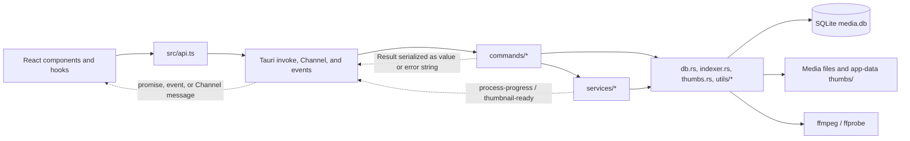

# System overview

This page describes the architecture that is implemented today. The source code and executable configuration are authoritative. Planning documents under `docs/plans/` are not evidence of current behavior.

For narrower contracts, use the canonical pages for [frontend architecture](../frontend/architecture-and-ui-conventions.md), [IPC](ipc-contract.md), [database persistence](../subsystems/database.md), [scanning](../subsystems/scanning-and-indexing.md), [library queries and the gallery](../subsystems/library-query-and-gallery.md), [thumbnails](../subsystems/thumbnails.md), [search, tags, and media groups](../subsystems/search-tags-and-media-groups.md), [lightbox behavior](../subsystems/lightbox.md), [settings operations](../subsystems/settings-operations.md), and [data safety and portability](../subsystems/data-safety-and-portability.md).

## Architecture and data flow

The normal request path is:

1. `src/main.tsx` loads i18n and styles, applies the persisted theme before rendering, and mounts `App` under React `StrictMode`. Optional frontend performance instrumentation is enabled by `VITE_MEDIATAGGER_PERF=1`.
2. `App.tsx` delegates application state and actions to `useAppShellController`; settings, bulk-action, and lightbox views are lazy-loaded and prefetched after 1.5 seconds.
3. Feature hooks call typed wrappers in `src/api.ts`. Those wrappers are the frontend IPC seam: they translate UI concepts into Tauri command names and payloads, create an IPC `Channel` for streamed thumbnail results, use `convertFileSrc` for image/GIF URLs, and request private loopback URLs for video playback.
4. Tauri dispatches the request to a function registered by `tauri::generate_handler!` in `src-tauri/src/lib.rs`. Command functions validate or normalize inputs, obtain `AppState`, acquire a workflow lock where required, and either perform a small operation or delegate to a service.
5. Services coordinate scanning, query sessions, backups, progress, and thumbnail scheduling. `db.rs` owns SQL; `indexer.rs` discovers and inspects media; `thumbs.rs` performs image/video probing and rendering; filesystem mutations occur in the command or service responsible for that workflow.
6. Results return through the invoke promise. Long-running settings work also emits `process-progress`; on-demand thumbnail batches use a `Channel<ThumbnailStreamEvent>`, while some thumbnail workflows emit `thumbnail-ready`.

Concrete examples:

- Gallery refresh calls `startAssetQuery`, which invokes `start_asset_query`. The query manager reads the library revision through a small connection pool, caches at most four ID-list sessions for five minutes, and materializes requested summaries from SQLite. Later pages call `get_asset_query_page`; a revision mismatch returns `stale`, causing the frontend to refresh.
- A scan invokes `scan_folder` or `rescan_all_roots`, takes the scan lock, walks supported files, fingerprints them, extracts metadata (including video duration through ffprobe/ffmpeg), commits batched SQLite updates, and removes stale database rows. Scanning reads source media; it does not copy it into app data.
- Visible gallery items are queued by asset ID. `ensure_thumbnails` takes a shared thumbnail lock and submits deduplicated high-priority jobs to the process-wide scheduler. Images are decoded in Rust; video frames use ffmpeg. Successful paths and failures are persisted in SQLite, and the generated files live under the profile's `thumbs/` directory.
- Delete, rename, root removal, library clear, and bundle restore cross both SQLite and the filesystem. These operations take both workflow locks, always in the order described below.
- Image, GIF, and thumbnail paths returned to React are normalized from Windows backslashes before `convertFileSrc` maps them to Tauri's asset protocol. Video playback uses a tokenized `127.0.0.1` URL resolved by asset ID; the dedicated Hyper/Tokio server streams the file with asynchronous, backpressure-aware GET, HEAD, and byte-range responses without carrying bytes through IPC. It accepts at most 32 active connections, closes clients that do not finish headers within five seconds, bounds request preparation to ten seconds and stalled writes to 30 seconds, and disables HTTP keep-alive.

## Executable bootstrap and runtime lifecycle

`src-tauri/src/main.rs` is deliberately only the binary entry point. It hides the console window in non-debug Windows builds and calls `media_tagger::run()`. The actual Tauri bootstrap is the library function `run()` in `src-tauri/src/lib.rs`, which:

1. creates a `tauri::Builder` and installs the dialog plugin;
2. during `setup`, refuses a debug build whose effective identifier is the production identifier;
3. resolves and creates the identifier-specific app-data directory;
4. acquires and manages the profile's `InstanceLock` before opening the database;
5. creates `thumbs/`, opens `media.db`, and initializes or migrates its schema;
6. starts the loopback video server, resolves ffmpeg, creates the thumbnail scheduler, and manages `AppState` plus the separate media-server state;
7. registers every frontend-callable command; and
8. runs the generated Tauri context until the application exits.

Startup failure in any setup step prevents the windowed application from entering its normal event loop. `build.rs` only calls `tauri_build::build()`; compile-time application metadata and resources come from the effective Tauri configuration.

## Backend module boundaries

| Module | Current responsibility |
| --- | --- |
| `main.rs` | Native binary shim only. |
| `lib.rs` | Builder setup, profile safety guard, app-data initialization, managed state, command registration, ffmpeg resolution, and process launch. |
| `app/state.rs` | Process-wide shared runtime state. |
| `app/instance_lock.rs` | Per-profile interprocess ownership of the app-data directory. |
| `app/locks.rs` | In-process workflow lock helpers and the canonical combined lock order. |
| `commands/*` | Tauri IPC endpoints, validation, error-string conversion, and some orchestration. Commands are intended to be thin, although several asset and import/export commands still contain substantial workflow logic. |
| `services/*` | Asset-query sessions, SQLite connection pooling for those queries, asynchronous loopback video streaming, scan orchestration, thumbnail scheduling/workflows, backup/restore, and progress emission. |
| `db.rs` | Schema initialization and SQLite queries/transactions. Connections use WAL, `synchronous=NORMAL`, foreign keys, a memory temp store, cache/mmap tuning, and a five-second busy timeout. |
| `indexer.rs` | Supported-file discovery, fingerprints, and media metadata extraction. |
| `thumbs.rs` | Image/video thumbnail creation and video duration probing. |
| `models.rs` | Backend serializable data models. |
| `utils/*` | Path and tag normalization helpers. |
| `error.rs` | `AppError` and `AppResult`; command boundaries currently flatten errors to strings. |

### Managed state

`AppState` contains:

- the profile-specific `db_path` and `thumbs_dir`;
- the resolved `ffmpeg_path` (also copied into the scheduler);
- `scan_lock` and `thumb_lock`;
- the shared `ThumbnailScheduler`; and
- atomics that enforce one bulk-thumbnail render and carry its cancellation request.

The `InstanceLock` and `MediaServerState` are separately managed by Tauri so their lock/listener lifetimes match the application. Dropping `MediaServerState` signals shutdown, aborts active connection tasks, drains their `JoinSet`, and joins the dedicated server thread. Transient listener errors use bounded exponential backoff; eight consecutive failures stop the listener and make later video-URL requests report that the server is unavailable. The query manager and its connection-pool registry are process-wide `OnceLock` singletons rather than `AppState` fields.

## Profiles, identifiers, and data isolation

The effective Tauri identifier determines `app.path().app_data_dir()`, so it is the boundary for `media.db`, `thumbs/`, restore staging, and `instance.lock`.

| Profile | How it is selected | Product/window name | Identifier | Isolation behavior |
| --- | --- | --- | --- | --- |
| Release | `bun run tauri:build:release` / base `tauri.conf.json` | `Image Viewer 3000` | `com.example.mediatagger` | Production app-data profile and normal `src-tauri/target` build output. |
| Development | `bun run tauri:dev`, merging `tauri.conf.dev.json` over the base | `Image Viewer 3000 Dev` | `com.example.mediatagger.dev` | Separate app-data profile. Debug startup refuses the production identifier, making use of the dev or E2E overlay mandatory for a debug application. |
| Desktop E2E | `bun run test:e2e:tauri`, merging `tauri.conf.e2e.json` | `Image Viewer 3000 E2E` | `com.example.mediatagger.e2e` | Separate app data and `src-tauri/target-e2e`. The runner validates the identifier, title, and target path, clears only the exact E2E app-data directory, builds the frontend separately, then makes an unbundled debug Tauri build. |

These profiles may run at the same time because their identifiers resolve to different data directories and lock files. Isolation relies on always selecting the intended config overlay. The debug guard protects production from an accidentally unoverlaid debug build, but it does not validate arbitrary non-production identifiers. The E2E runner adds stronger path/title checks before its destructive cleanup and again verifies the live window title before tests.

### `instance.lock`

On startup, `InstanceLock::acquire` opens or creates `<app-data>/instance.lock` and requests a non-blocking exclusive OS file lock. Contention fails startup with a message that another MediaTagger instance is using the profile. The open handle is retained by Tauri and explicitly unlocked on drop.

This guarantee is per identifier/profile, not machine-wide. The lock file itself may remain after a clean exit; ownership is represented by the OS lock, not file existence. The lock is acquired before `media.db` is opened, preventing two application processes from normally sharing one profile, but it does not protect against external tools editing that directory.

## In-process locking policy

The profile lock sits outside the runtime lock hierarchy. Inside one process, command-level workflow locks have the following matrix:

| Lock | Operations | What it excludes |
| --- | --- | --- |
| `scan_lock: Mutex<()>` | `scan_folder`, `rescan_all_roots` | Another scan and every combined destructive operation. |
| Shared `thumb_lock` read guard | Render all/failed thumbnails, cancel bulk render, ensure one/page/streamed thumbnails | A destructive thumbnail write guard; multiple thumbnail readers may coexist. The bulk-render atomic separately rejects a second bulk render. |
| Exclusive `thumb_lock` write guard | `clear_all_thumbnails` | All thumbnail render/ensure readers and combined destructive operations. |
| `scan_lock` then exclusive `thumb_lock` | Remove scan root, delete or rename an asset file, clear library data, export a DB bundle, import a DB bundle | Scans, thumbnail work, and every other combined operation. |
| No workflow lock | Queries/details/tag and favorite/group writes, duplicate lookup, CSV import/export, scan-root list/add, and window-theme sync | Only SQLite/filesystem primitives and any operation-local synchronization apply. |

Whenever both locks are needed, `with_scan_and_thumb_lock` acquires `scan_lock` first and the thumbnail write lock second. Preserve this order; acquiring them separately or in reverse can deadlock. `ThumbnailScheduler`, the query cache, and the query connection pool have their own internal synchronization and are not substitutes for these workflow locks.

The React settings runner also suppresses concurrent settings operations in one mounted frontend, but that is a user-interface convenience, not a backend safety boundary. Direct IPC callers can still invoke commands concurrently.

## Bundled media tools and resources

The Windows platform bundle config declares `binaries/ffmpeg` and `binaries/ffprobe` as Tauri external binaries. The required Windows target-triple executables are ignored by Git and must be supplied manually:

- `src-tauri/binaries/ffmpeg-x86_64-pc-windows-msvc.exe`
- `src-tauri/binaries/ffprobe-x86_64-pc-windows-msvc.exe`

A fresh checkout does not contain these files and cannot produce a complete Windows package until both are provided.

At runtime, `lib.rs` looks for ffmpeg in the Tauri resource directory, `binaries/` subdirectories, locations adjacent to the executable, and parent `resources/` directories. In each location it tries `ffmpeg.exe`, `ffmpeg`, then the lexicographically first regular file whose stem starts with `ffmpeg-`. If none exists, it falls back to the command name `ffmpeg` and therefore the process `PATH`.

Duration probing derives a matching ffprobe name from the selected ffmpeg suffix, then tries `ffprobe.exe`/`ffprobe` beside it and finally `ffprobe` on `PATH`. Linux packages intentionally have no sidecar and use the system tools through this fallback. If ffprobe cannot provide a duration, probing falls back to parsing ffmpeg output. Video tools have timeouts, and Windows launches them without a console window. A missing or unusable tool therefore degrades video metadata/thumbnail work rather than preventing application bootstrap.

## Tauri security surface and Windows packaging

Current configuration is permissive and should be treated as current state, not a recommended end state:

- `capabilities/default.json` applies to the `main` window and grants `core:default` plus `dialog:default` (open, save, and message dialogs). Application commands are those explicitly registered in `lib.rs`.
- The Tauri `protocol-asset` feature is compiled in. The asset protocol is enabled with scope `['**']`, allowing the WebView's asset URLs to address arbitrary filesystem paths accepted by that protocol. Images, GIFs, and thumbnails still use this path; video URLs instead expose only SQLite-owned video IDs through a tokenized loopback server.
- `app.security.csp` is `null`, so the configuration does not install a Content Security Policy.
- The Windows release window passes WebView2 arguments that disable Microsoft OOUI/PDF UI and SmartScreen protection and relax autoplay. The dev overlay repeats those arguments; the E2E window configuration does not.
- Platform configs bundle MSI/NSIS with both media tools on Windows and disable bundling for the native Linux executable, which uses host media tools and GStreamer plugins. macOS and ARM targets are not configured.

Security-sensitive changes should review capabilities, CSP, asset scope, dialog permissions, WebView arguments, and the direct `convertFileSrc` flow together. See [setup and build](../development/setup-and-build.md) for build prerequisites and commands.

## Naming state

The project identity is not yet consistent:

- Repository guidance, the npm package (`media-tagger`), Rust crate/binary (`media_tagger`), identifiers, E2E suite labels, performance variables, and lock-contention text use **MediaTagger**.
- Tauri product names, window titles, and icon filenames use **Image Viewer 3000** (with `Dev`/`E2E` suffixes where applicable).
- `index.html` currently contains the additional typo **Image Viewr 3000**. Tauri window titles override what users normally see in desktop runs, but the HTML title remains visible in browser/Vite contexts and is still part of the source.

Treat renaming as a migration, not a cosmetic search-and-replace. Changing the Tauri identifier changes the app-data directory and can make an existing library appear empty unless data is migrated. Renaming the Rust binary also affects the E2E executable path; product names affect package/window expectations.

## Current guarantees and known limitations

Current guarantees include:

- a normal application process exclusively owns one identifier-specific data profile before opening SQLite;
- release, dev, and E2E configs use distinct identifiers, and debug builds refuse the production identifier;
- SQLite schema initialization runs at every successful startup and connections consistently enable WAL and foreign keys;
- combined destructive workflows use one helper and a fixed `scan`-then-`thumb` lock order;
- thumbnail scheduling deduplicates work by target path, prioritizes visible work, limits concurrent video jobs, records failures, and preserves completed work when bulk cancellation is requested;
- query sessions are revision-bound, so a changed library invalidates subsequent pages; and
- E2E cleanup contains explicit identifier, directory, target, and live-title safeguards.

Known limitations include:

- CSP is disabled, the asset scope is global, and release/dev disable WebView2 SmartScreen protection.
- The profile lock has no direct automated test, and bootstrap/profile guards and ffmpeg search precedence are not directly unit-tested.
- Workflow locking is selective. Tag/favorite/group writes, CSV import, adding roots, and reads may overlap a scan; correctness then depends on SQLite transactions, WAL, the busy timeout, revision bumps, and operation-specific code rather than the workflow locks.
- `AppState` fields are public, so module boundaries are conventions rather than compiler-enforced interfaces.
- Several command handlers contain filesystem/DB orchestration instead of being strictly thin adapters.
- Backend errors are flattened to strings at IPC boundaries, so the frontend cannot reliably branch on structured error categories.
- The frontend passes a generation as `start_asset_query.generation` and a request ID to `ensure_thumbnails`, but the backend currently discards both values. Supersession is process-global in the query manager, while stale frontend thumbnail messages are filtered locally by generation.
- Many progress emissions deliberately ignore delivery errors; completion of the underlying operation does not guarantee that every progress update reached the WebView.
- Packaging supports Windows and Linux x86-64; Windows sidecars must be supplied locally, Linux requires system ffmpeg/ffprobe, and the production identifier still uses the example domain.

## Safe-change checklist

Before merging an architectural change:

- Trace the complete path from the calling hook/component through `src/api.ts`, the registered Tauri command, service/core code, and every SQLite/filesystem effect. Update the [IPC contract](ipc-contract.md) if names, payloads, channels, events, or error semantics change.
- If adding a command, register it in `lib.rs`, expose it through `src/api.ts`, validate at the command boundary, and prefer orchestration in the appropriate service.
- Classify the operation in the lock matrix. Use the shared helpers; if both locks are needed, acquire scan before the exclusive thumbnail lock. Consider direct IPC concurrency, not only UI button state.
- For `AppState` changes, update bootstrap construction and all test fixtures. Decide whether the value truly belongs in managed state or in a focused service.
- For database writes, use transactions where a workflow must be atomic, bump the library revision when query-visible state changes, and invalidate process caches/pools when replacing the database. Follow [database](../subsystems/database.md) and [data safety](../subsystems/data-safety-and-portability.md) guidance.
- For file mutations, define failure ordering and rollback/repair behavior across the database, source file, thumbnail, WAL/SHM sidecars, and restore staging.
- Never reuse the production identifier or app-data cleanup target for dev/E2E. Preserve the E2E identifier/title/target assertions when changing configuration.
- When changing product, crate, or binary names, update packaging, icons, sidecar names, E2E paths, user-visible text, and data migration intentionally.
- When changing media loading, assess CSP, capabilities, asset-protocol scope, and whether paths can be constrained to registered roots and profile thumbnails.
- When changing ffmpeg packaging, verify both ffmpeg and its matching ffprobe for every target triple and test installed-package resource layout, not only PATH-based development behavior.

## Verification map

Use [testing](../development/testing.md) for the full test workflow. The most relevant existing checks are:

- `src/__tests__/api.test.ts`: invoke payload mapping and Windows-path normalization before `convertFileSrc`.
- Frontend hook/component tests under `src/hooks/**/__tests__` and `src/components/**/__tests__`: query lifecycle, thumbnail queues, settings progress, mutation refreshes, and UI behavior.
- Rust unit tests in `db.rs`, `commands/*`, `services/*`, `thumbs.rs`, and utilities: schema migration/query behavior, command validation, scan cleanup, backup sidecars and restore, thumbnail cancellation/scheduling, and video parsing.
- `src-tauri/tests/backend_integration.rs`: file-backed SQLite query, tag/group mutation, deletion, and clear flows.
- `src-tauri/tests/backend_e2e.rs`: a Rust-only end-to-end CSV merge/library-clear workflow; despite its name, it does not launch Tauri or validate profiles and packaging.
- `e2e/build-e2e.js` and `e2e/wdio.conf.js`: destructive-test isolation and real desktop build/driver setup.
- `e2e/specs/*.e2e.js`: real-window smoke and workflows covering settings, filtering, roots, bulk edits, lightbox mutations, CSV, and DB bundles.
- `src-tauri/tauri.conf*.json`, `capabilities/default.json`, `Cargo.toml`, locally supplied `binaries/`, checked-in `icons/`, `package.json`, and `index.html`: configuration checks that tests do not fully replace.

At minimum, run `bun run build`, `bun run test`, and `bun run test:backend` after code changes. Run `bun run test:e2e:tauri` for IPC, bootstrap, profile, packaging-adjacent, filesystem, or full-workflow changes. Installed MSI/NSIS resource layout and sidecar launch still require a packaged Windows smoke test beyond the unbundled E2E executable.
